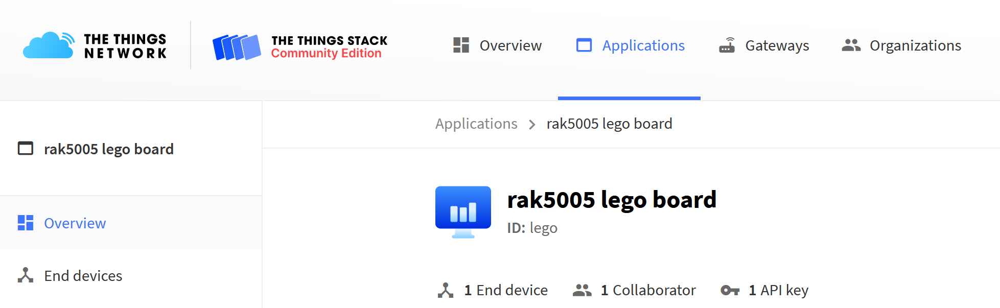
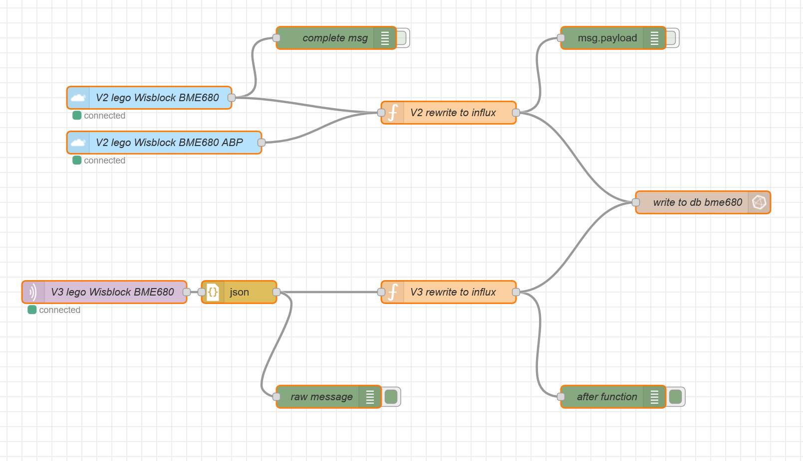
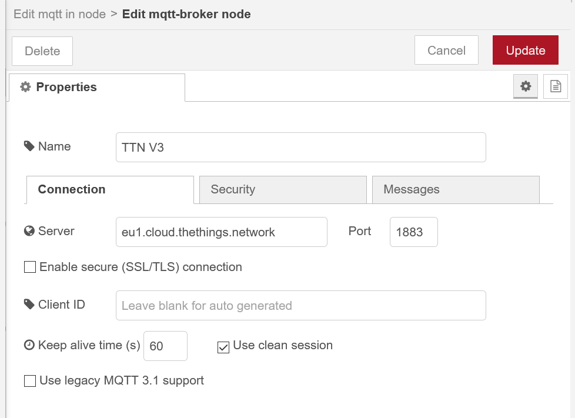
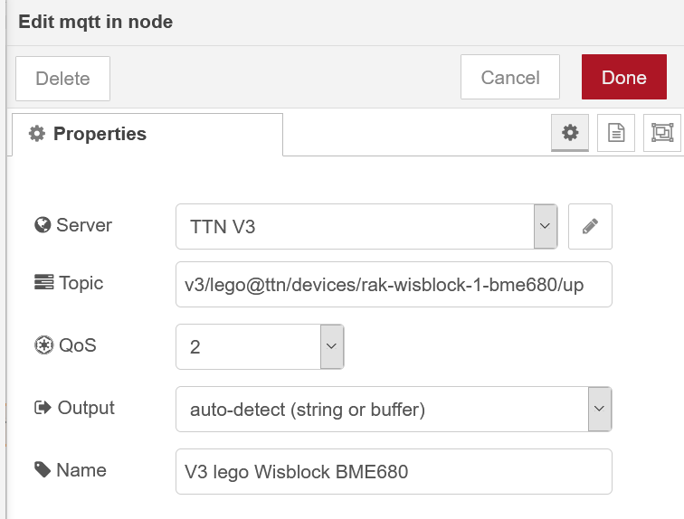
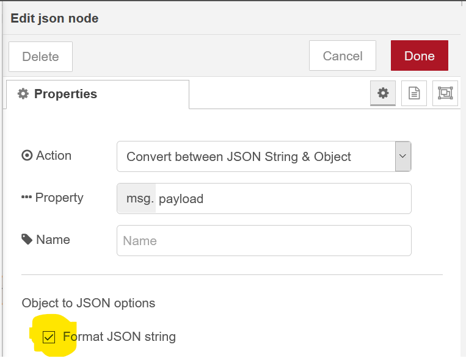

# tl;dr
Thethingsnetwork V3 upgrade is in full swing. So if you migrated some devices and you use Node-Red, you noticed that the ttn-contrib doesn't work anymore and that the payload format is much different than V2. This is an example for upgrading the Node-Red TTN devices (The Things Nework) from V2 to V3 while using the same InfluxDB (or any other) and eventually running TTN devices on v2 and V3 in paralell on Node-Red

I am using here the RAK Wisnode with a a BME680 as described in https://github.com/baxtery/LoRawan_Wisblock_BME680 (inlcuding decoder)

So the old V2 Node-Red-ttn Contrib is deprecated and doesn't work for V3, but actually u can still run it in paralell to write to the same DB while you move the devices in the TTN console.

## Prerequisits
1. you have moved your device from V2 to V3 - basically recreate the device in V3 console https://console.cloud.thethings.network/
2. you have copied/made a decrypt function in V3 in the console
3. you have created the MQTT integration in the device console and created an API key (to use in Node-Red MQTT node)
 for more information on this part you can use the TTN howto https://www.thethingsindustries.com/docs/integrations/node-red/

## You will need to

1. use the MQTT node in the Node_red contrib (no need to inslall anything)
Configure the node as MQTT client for TTN Server : *eu1.cloud.thethings.network* Port *1883* and subscribe to your device uplink (topic)

Go to Security tab and add you API keys
Now go back to the main screen of the MQTT node
as described in https://www.thethingsindustries.com/docs/integrations/mqtt/, use
	v3/{application id}@{tenant id}/devices/{device id}/up

2. then use a JSON formatter node available in the Node-red Contrib

3. then update the function to prepare the data you want to inject in Influx DB. The path msg.payload has changed significantly.

## Retrieve Variables
#### Most variables are now in
	msg.payload.uplink_message.decoded_payload.XXX
#### Device info are in
	dev_id: msg.payload.end_device_ids.device_id,
	app_id: msg.payload.end_device_ids.application_ids.application_id,
#### Network info
	rssi: msg.payload.uplink_message.rx_metadata[i].rssi,
	snr: msg.payload.uplink_message.rx_metadata[i].snr,
	frequency: msg.payload.uplink_message.settings.frequency,

You can refer to TTN_V3_Node_red_function https://github.com/baxtery/TTN_V3_Node-Red/blob/main/TTN_V3_Node_red_function
please compare the code for V2 and V3 and make sure you have all your vairables as in V2

# Notes
- Here we are connecting single devices, in v2 we connected APPs, check if this can be done
- Note that I am connecting to a V2 Gateway, hence "Gateway ID" will appear as "Broker". 
